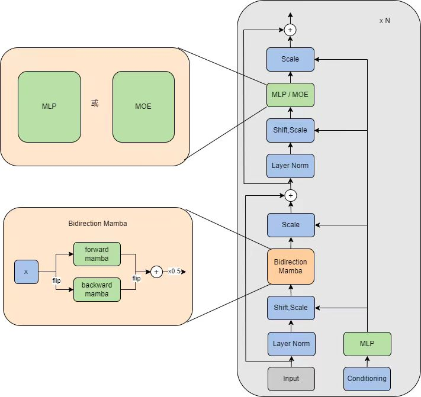

## DiT with MoE \ Mamba Block

This repository is a modification of [fast DiT](https://github.com/chuanyangjin/fast-DiT). It provides two different blocks. <br> The first block is based on the MoE (Mixture of Experts) module. The second block is a re-implementation of the bi-mamba block, inspired by [DIFFUSSM](https://arxiv.org/ads/2311.18257) and [Vim](https://github.com/hustvl/Vim) 

The version 2 of the bi-mamba block is as follows:



The version 3 is moe version. see [`models.py`](models.py) for details.

There is **no** completed version yet. <br>

There are some experimental results:

| DiT Model  | Train Steps | FID-50K<br> (PyTorch Training) | PyTorch Global Training Seed |
|------------|-------------|--------------------------------|------------------------------|
| XL/2       | 400K        | **18.1**                       | 42                           |
| B/4        | 400K        | 68.9                           | 42                           |
| B/4        | 400K        | **68.3**                       | 100                          |
|------------|-------------|--------------------------------|------------------------------|
| DiM-B/4    | 400K        | 58.6                           | 0                            |
| DiM-L/2    | 400K        | 19.8                           | 0                            |


## Sampling of DiM-L/2（400K Step）


### Preparation Before Training
To extract ImageNet features with `1` GPUs on one node:

```bash
bash extract_feature.sh
```

### Training
To launch DiT-XL/2 (256x256) training with `N` GPUs on one node:
```bash
bash train.sh
```

## Evaluation (FID, Inception Score, etc.)

```bash
bash sample_ddp.sh
```

generates a folder of samples as well as a `.npz` file which can be directly used with [ADM's TensorFlow
evaluation suite](https://github.com/openai/guided-diffusion/tree/main/evaluations) to compute FID, Inception Score and other metrics. 


